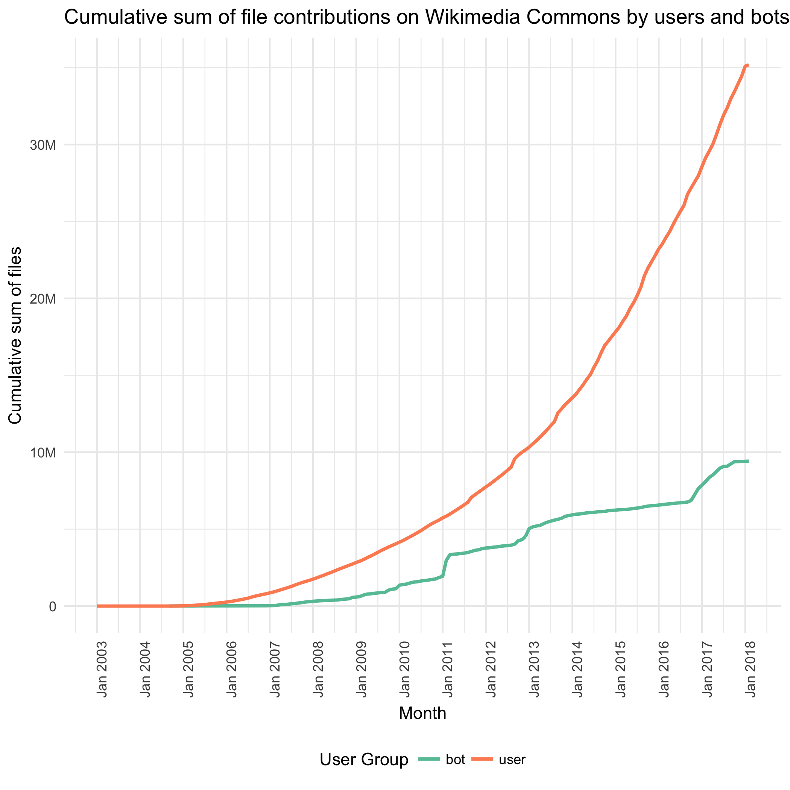
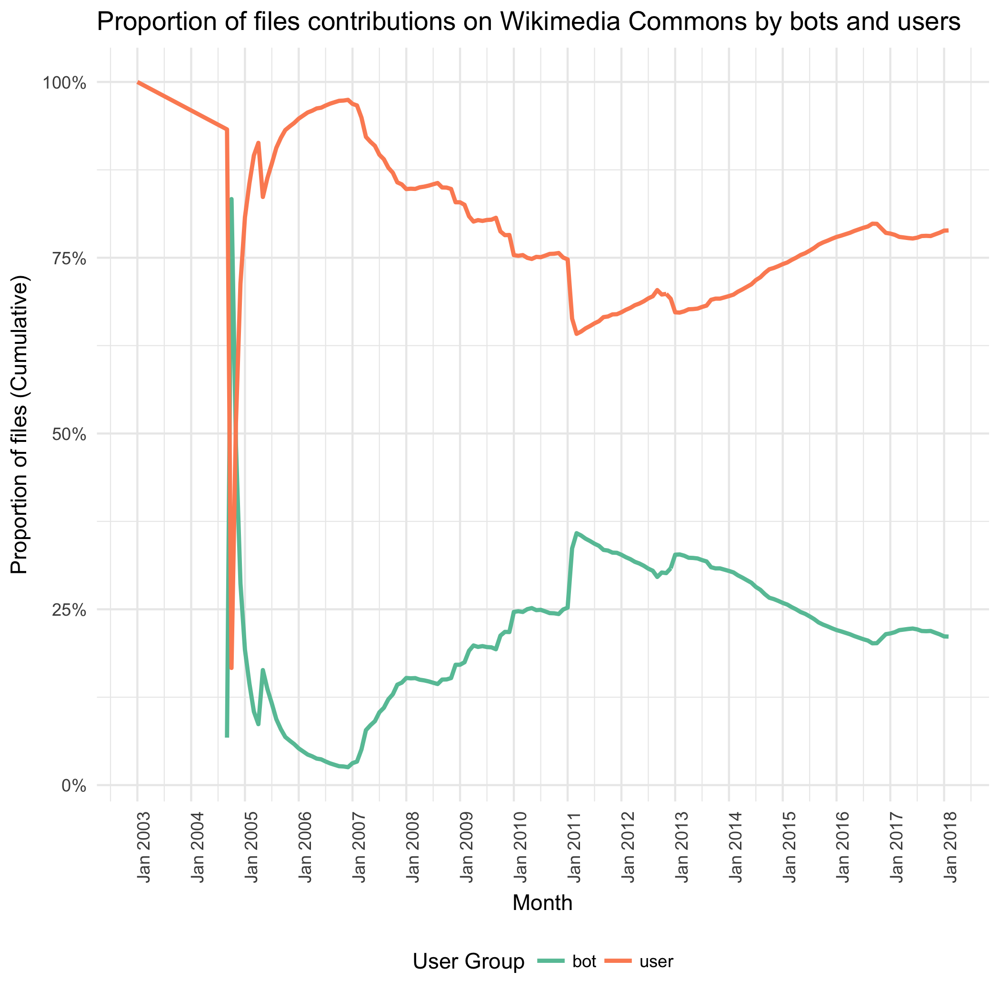
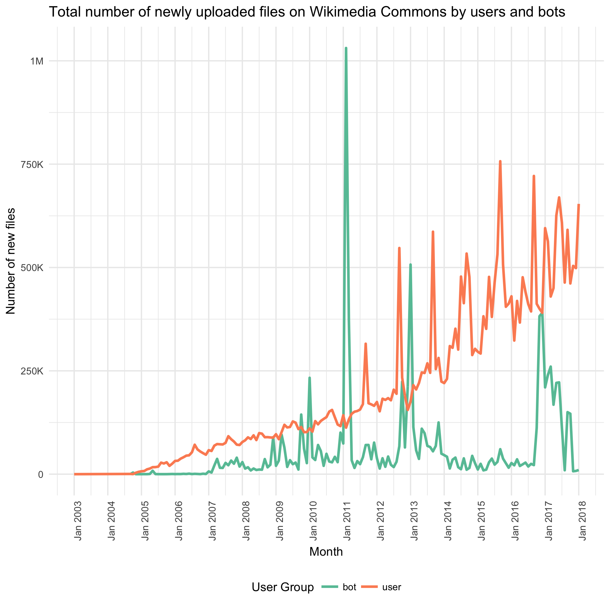

# Wikimedia Commons: File Contributions by Bots and Users (Redux)

This is a replicate of Chelsy's report from October 12, 2017,  [T177354](https://github.com/wikimedia-research/SDoC-Initial-Metrics/tree/master/T177354), comparing file contributions by bots and users to Wikimedia Commons from the launch of Commons in September 2004 to the end of January 2018.

The total number of files uploaded by bots is 9,418,169 (22.04%), and the number of files uploaded by users is 35,180,917 (77.96%). In just the month of January 2018, 10,066 of new files were uploaded by bots and 653,997 files were uploaded by users. This is an increase from the month of December 2017 where 7,831 new files were uploaded by bots and 498,542 files were uploaded by users.

As shown in the table below, bitmaps are the most common media type files uploaded by both bots and users, comprising 94.30% of all media contributions to Wikimedia Commons.

|Media Type |User Group |Number of Files|Proportion |
|:--------------|:----------|--------:|----------:|
|bitmap         |user       | 33193791|74.42%     |
|bitmap         |bot        |  8865779|19.88%     |
|drawing        |user       |   956725|2.15%      |
|drawing        |bot        |   274667|0.62%      |
|audio          |user       |   708837|1.59%      |
|audio          |bot        |    95764|0.21%      |
|video          |user       |    76395|0.17%      |
|video          |bot        |    36423|0.08%      |
|multimedia     |user       |        4|0%         |
|office         |user       |   247625|0.56%      |
|office         |bot        |   145494|0.33%      |

*Some bots are operated by institution, and some are tools like [Flickr upload bot](https://commons.wikimedia.org/wiki/User:Flickr_upload_bot).

The following graphs show the total number of file contributions each month, both cumulative and non-cumulative.

