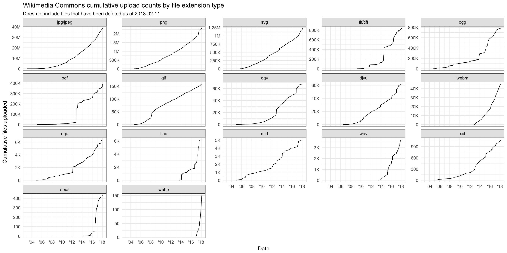
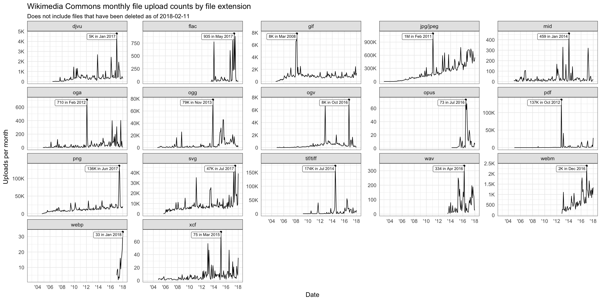
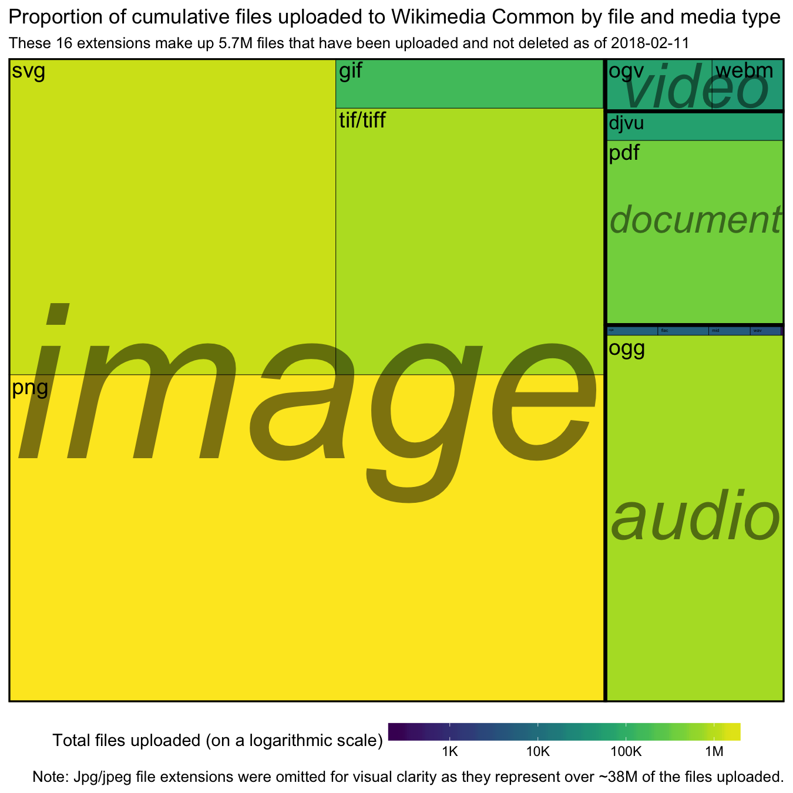
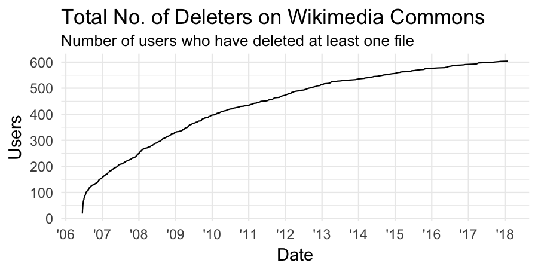
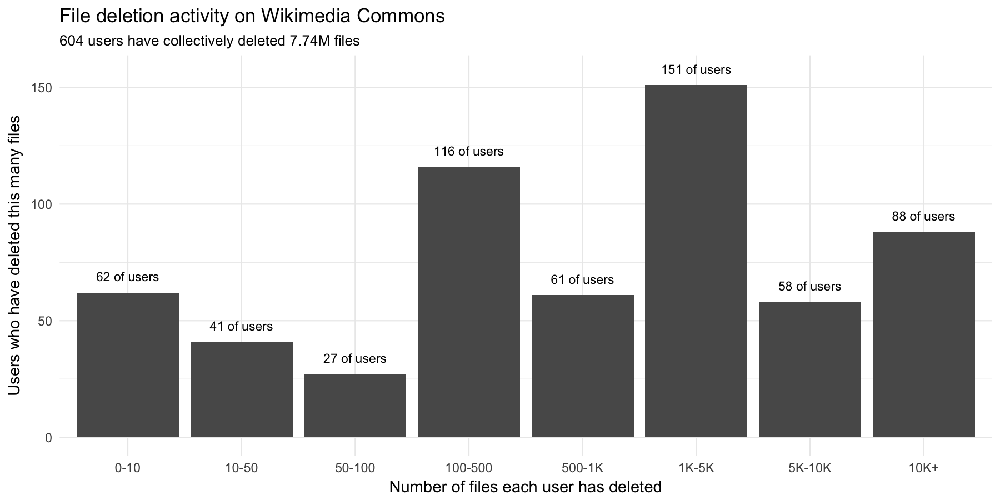
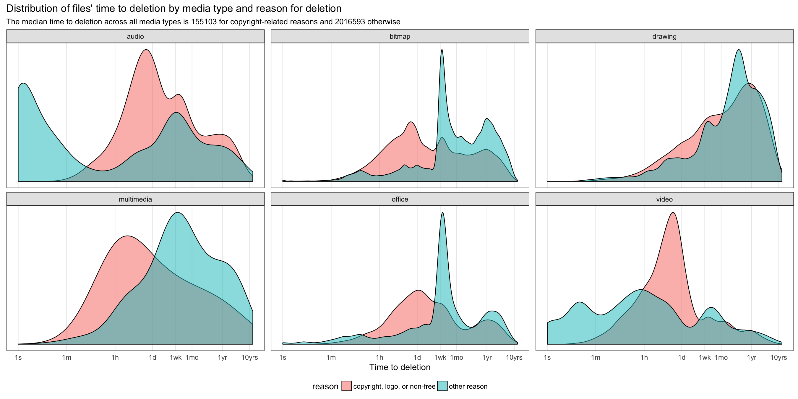
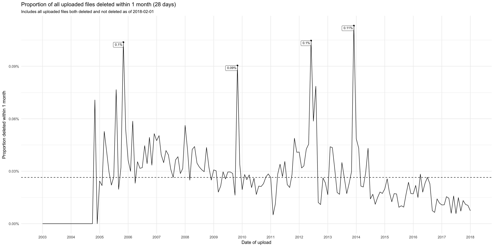
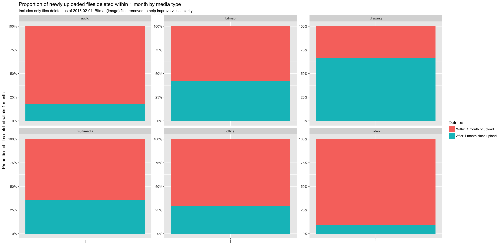
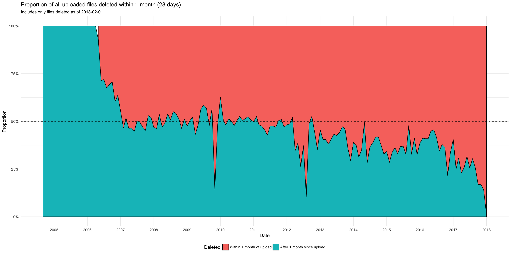

# Wikimedia Commons: File type and deletion metrics (Redux)

This is a replicate of Mikhail's report from October 2017, [T177356](https://phabricator.wikimedia.org/T177356), reviewing several metrics related to file types and deletion behaviors using filearchive and image table in commonswiki database. This analysis incudes data collected from the launch of Commons in September 2004 to the end of January 2018.

## Questions Reviewed

1. The distribution of file types and extensions. 
2. Cumulative upload counts and new upload counts per month by file extension. 
3. Number of deleters (users who have deleted at least one file) over time.
4. How many files each user has deleted?
5. Time to deletion, broken up by file type and reason for deletion (copyright violation vs other)
6. The proportion of files deleted within a month after uploaded. How does this deletion rate look like over time?

## Distribution of file types

I queried the image table of the commons wiki to select the img_timestamp and file extension type (jpeg, gif, png, etc). The file name was used to determine the format of the file as the "img_minor_mime" and "img_media_type" fields may not be accurately labeled for all files. Note these metrics do not include files that were deleted as of 2018-02-11. 

I found similar trends as found in Mikhail's analysis. As of February 11, 2018, over 86% of file contributions on Commons are images files in with the jpg/jpeg extension. Audio files (primarily in the .ogg formats) represent the second largest portion (1.8%) of file uploads. 

### Total files uploaded to Commons (as of 2018-02-11) by extension:

|media	|extension| uploads
|:--------------|:--------:|----------:|
|image	|jpg/jpeg| 38809538
|image	|png	|2326268
|image	|svg	|1232540
|image	|tif/tiff|854857
|audio	|ogg	|781953
|document |pdf	|393441
|image	|gif	|158878
|video	|ogv	|67388
|document|djvu	|61961
|video	|webm	|45710
|audio	|oga	|6378
|audio	|flac	|6184
|audio	|mid	|5058
|audio	|wav	|3726
|image	|xcf	|1084
|audio	|opus	|430
|image	|webp	|171

## Deletions by Users

By the end of January 2018, a total of 604 users had deleted at least one file. 151 users had deleted 1K-5K files and 116 users deleted between 110 and 500 files. 

## Time to deletion

### Time to deletion, broken up by file type and reason for deletion (copyright violation vs. other).

As indicated in the Oct 2017 report, most copyright-related deletions happen within 1 day of upload across almost all media types, with the exception of 'drawing' (SVGs) files where most deletions happen within 1 month to a year. A lot of audio files are deleted within 1 minute or 1 week of upload. Half of all deleted images and PDFs (office) were deleted within 1 month of upload for non-copyright reasons.

### The proportion of files deleted within a month after uploaded. How does this deletion rate look like over time?

I aslo reviewed the proportion of uploaded files deleted within a month (28 days) after upload date, querying both the image and file archive tables to obtain all uploads each month (both deleted and not deleted before 2018-02-01). An average of 13.3% of all uploaded files per month are deleted within 28 days after upload. The highest proportion of deletions within a month occurred in Novomber 2004 (41.38). From about 2013 to 2018, there has been an overall decrease in the proportion of deletions within a month after upload.

I previously looked at the proportion of uploaded files deleted within month for only files that were deleted before 2018-02-01, querying just the file archive table of the Commons database. This does not include any files not deleted as of 2018-02-10. Results from this analysis are shown below. With the exception of drawing type files, over 50% of deleted video, audio, and office type files are deleted within 1 month after they are uploaded. 

Note: These plots only reflect only files deleted before 2018-02-01 and the trends depicted are expected to change as additional files are deleted after 2018-02-01. For example, the proportion of archived files deleted within a month is high for January 2018 because only one month has passed when this query was taken in February 2018. The proportion of deleted files after 1 month for January 2018 is expected to increase in the future as more uploads from this month are deleted. 

## Next Steps ##
1. Calculate and plot the CI (confidence interval or credible interval) band of the line for plots of proportion of files deleted within a month (28 days)
2. Might be interesting to review deletions broken down by bots vs users.

